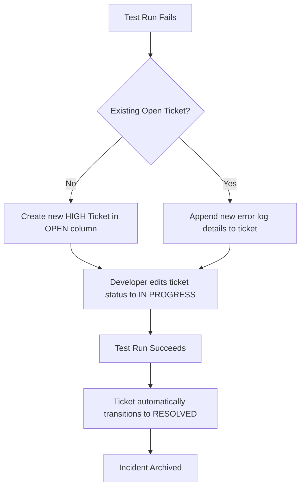

# WebTestNReport User Guide 📖

This guide details how to create and schedule automated tests, interpret execution results, manage failure incident tickets, and configure the application.

---

## 📝 Scratchpad DSL Scripting Reference

The Scratchpad Scripting Language is a line-by-line scripting grammar executed sequentially inside a headless browser by the [PlaywrightTestRunner](src/main/java/com/example/webtestnreport/service/PlaywrightTestRunner.java).

### Core Script Rules
- **Formatting**: Each command must start on a new line.
- **Comments**: Any line starting with `#` or `//` is ignored. Use them to document scripts.
- **Whitespace**: Leading and trailing whitespaces are trimmed automatically.
- **Failures**: If any step encounters an error or an assertion fails, the execution terminates immediately. The application captures a failure screenshot and records the logs.

---

### Command Syntax

#### 1. Navigation & Interactions

* **`goto <URL>`**
  Navigates the browser to the specified web address and waits for the page to fire its load state.
  ```text
  goto https://example.com
  ```

* **`click <Selector>`**
  Performs a click action on the DOM element matching the selector.
  ```text
  click button#submit-login
  ```

* **`fill <Selector> = <Value>`**
  Clears the input field matched by the selector and inserts the specified text value.
  ```text
  fill input[name="username"] = test_user_qa
  ```

* **`type <Selector> = <Value>`**
  Types character-by-character into the input field matched by the selector. Useful for elements reacting to individual keydown/keyup events.
  ```text
  type input#search-query = Playwright Java Integration
  ```

* **`check <Selector>`**
  Checks a checkbox or radio button element.
  ```text
  check input#terms-and-conditions
  ```

* **`uncheck <Selector>`**
  Unchecks a checkbox element.
  ```text
  uncheck input#marketing-newsletter
  ```

* **`press <Key>`**
  Simulates pressing a single keyboard key (e.g., `Enter`, `Tab`, `ArrowDown`, `Backspace`).
  ```text
  press Enter
  ```

* **`wait <ms>`**
  Pauses test execution for a static number of milliseconds. Use sparingly; assertions already wait for elements dynamically.
  ```text
  wait 1500
  ```

---

#### 2. Assertion Commands

* **`assert-text <Selector> = <Expected>`**
  Checks that the inner text content of the element matched by the selector contains the expected string. (This command automatically waits for the selector to appear in the DOM before asserting).
  ```text
  assert-text div.welcome-banner = Welcome back, test_user_qa
  ```

* **`assert-title = <Expected>`**
  Asserts that the browser page title contains the expected text.
  ```text
  assert-title = Dashboard - WebTestNReport
  ```

* **`assert-exists <Selector>`**
  Asserts that at least one element matching the selector exists in the page DOM structure.
  ```text
  assert-exists .success-check-icon
  ```

* **`assert-visible <Selector>`**
  Asserts that the element matched by the selector is visible on the page.
  ```text
  assert-visible button#logout-link
  ```

---

#### 3. Advanced E2E Pipelines & Stage Chaining

To chain multiple test types (UI, API, SQL, NoSQL) into a single E2E pipeline, you can use the following instructions:

* **`stage <Stage Name>`**
  Declares the start of a pipeline stage. Runs are organized by stages, which are displayed as a visual connector diagram on the execution detail modal.
  ```text
  stage User Registration Flow
  ```

* **Variables Substitution (`${variableName}`)**
  You can interpolate variables context in any step. Variables are populated using extraction commands (like `store-json` or `store-db`) and can be used in subsequent steps.
  ```text
  http-get /api/orders/${orderId}
  ```

---

#### 4. HTTP API Testing

Allows executing REST HTTP calls and asserting or storing response payload values. Relative URLs starting with `/` automatically target the local running server instance.

* **`header <Name> = <Value>`**
  Sets an HTTP request header for subsequent requests in the rule.
  ```text
  header Content-Type = application/json
  header Authorization = Bearer ${token}
  ```

* **`http-get <URL>` / `http-post <URL> = <Body>` / `http-put <URL> = <Body>` / `http-delete <URL>`**
  Executes an HTTP request.
  ```text
  http-post /api/rules = {"name": "Demo Rule"}
  ```

* **`assert-status = <Code>`**
  Asserts the HTTP status code of the last response.
  ```text
  assert-status = 200
  ```

* **`assert-json <JSONPath> = <Value>`**
  Asserts a field value in the last JSON response body using standard dot-notation.
  ```text
  assert-json 0.name = Check Example Domain
  ```

* **`store-json <JSONPath> = <VariableName>`**
  Extracts a JSON value from the last response body and stores it in the variable context.
  ```text
  store-json id = newRuleId
  ```

* **`store-header <HeaderName> = <VariableName>`**
  Extracts a response header value and stores it in the variable context.
  ```text
  store-header X-Request-ID = requestId
  ```

---

#### 5. SQL Database Verification

Allows running queries and updates on database contexts.

* **`db-connect [JDBC] [= Username | Password]`**
  Establishes a JDBC connection. Calling `db-connect` or `db-connect default` with no parameters automatically connects to the application's active Spring Boot H2 connection pool.
  ```text
  db-connect
  ```

* **`db-query <SQL>`**
  Runs a SQL SELECT query. Results are stored in the current query context.
  ```text
  db-query SELECT name FROM test_rules WHERE id = 1
  ```

* **`db-execute <SQL>`**
  Runs an insert, update, or delete SQL statement.
  ```text
  db-execute DELETE FROM test_rules WHERE id = ${newRuleId}
  ```

* **`assert-db <Column> = <Value>`**
  Asserts that the column value in the first row of the last query matches the expected value.
  ```text
  assert-db name = Check Example Domain
  ```

* **`assert-db-rows = <Count>`**
  Asserts that the last query returned the expected number of rows.
  ```text
  assert-db-rows = 1
  ```

* **`store-db <Column> = <VariableName>`**
  Extracts a column value from the first row of the last query and stores it in variables.
  ```text
  store-db id = firstRuleId
  ```

---

#### 6. Simulated NoSQL Document Store

Provides a lightweight simulated JSON document store stored locally in `data/nosql/` collections to mock NoSQL pipelines.

* **`nosql-insert <Collection> = <JSON>`**
  Inserts a document into the specified collection file. Generates a unique UUID `_id` field if not present.
  ```text
  nosql-insert carts = {"itemId": "item1", "qty": 3}
  ```

* **`nosql-find <Collection> = <JSONQuery>`**
  Queries the collection for matching documents. Results are saved in the NoSQL context.
  ```text
  nosql-find carts = {"itemId": "item1"}
  ```

* **`assert-nosql <Field> = <Value>`**
  Asserts that a field in the first matching document equals the expected value.
  ```text
  assert-nosql qty = 3
  ```

* **`store-nosql <Field> = <VariableName>`**
  Extracts a field from the first matching document and stores it in the variables context.
  ```text
  store-nosql itemId = currentItem
  ```

---

## 🎯 Selector Selection Best Practices

Selectors are evaluated using Playwright's selector resolver. You can use standard CSS selector rules:

- **ID Selector**: `h3#header-title`
- **Class Selector**: `button.btn-primary`
- **Attribute Selector**: `input[type="email"]`, `a[href="/home"]`
- **Hierarchical/Descendant Selector**: `div.card-body > form > button`
- **Text content helper (Playwright specific)**: `text="Create New Rule"` (Matches elements containing this exact text string).

---

## 🎫 Incident & Ticket Lifecycle Management

When a test run fails, [TicketService](src/main/java/com/example/webtestnreport/service/TicketService.java) manages the incident.



1. **Automatic Creation**: If a rule execution fails, a ticket is created with a `HIGH` severity and `OPEN` status. An error log summary is added along with a link to the failed run.
2. **Persistent Failures**: If a rule continues to fail across scheduled executions, the [TicketService](src/main/java/com/example/webtestnreport/service/TicketService.java) updates the existing ticket description with the new failure information instead of creating duplicate tickets.
3. **Manual Management**: On the frontend Kanban board ([index.html](src/main/resources/static/index.html)), users can drag/click tickets to transition them to `IN PROGRESS` while debugging.
4. **Auto-Resolution**: Once the root issue is fixed and the test rule passes (either via scheduled checking or manually triggering "Run Test Now"), the system marks the corresponding ticket as `RESOLVED` automatically.

---

## ⚙️ Advanced Configuration

All application configuration is defined in the [application.properties](src/main/resources/application.properties) file.

### Customizing Paths and Ports
```properties
# Change the port the dashboard runs on
server.port=8081

# Location where failure screenshots are written
app.screenshots.dir=./data/screenshots

# Database storage file path
spring.datasource.url=jdbc:h2:file:./data/webtestdb;DB_CLOSE_DELAY=-1;DB_CLOSE_ON_EXIT=FALSE
```

### Scheduling Logic
The scheduler ([RuleScheduler](src/main/java/com/example/webtestnreport/service/RuleScheduler.java)) runs a cron process every 60 seconds.
For each active rule, the scheduler calculates:
$$\text{Minutes Since Last Run} = \text{Current Time} - \text{Latest Run Start Time}$$
If the result is greater than or equal to the rule's specified `intervalMinutes`, a new background browser test run is triggered asynchronously.

---

## 🛠️ Troubleshooting

### Playwright Browser Launch Failures
- **Symptom**: Step logs display browser connection errors or show `PlaywrightException: Failed to launch browser`.
- **Solution**: Execute browser installation tools in your project directory:
  ```bash
  mvn exec:java -Dexec.mainClass="com.microsoft.playwright.CLI" -Dexec.args="install chromium"
  ```

### Database Lock Issues
- **Symptom**: `Database may be already in use: "Locked by another process"` error on server startup.
- **Solution**: Ensure no other instances of the server are running. H2 locks file databases. If you need to clear all rules/data, delete the `./data` directory contents.

### Element Not Found / Timeout Errors
- **Symptom**: Scripts fail with `TimeoutError` or `NoSuchElementException`.
- **Solution**:
  - Double check your selector using the browser's developer console (`Ctrl+Shift+I` on Chrome).
  - Web applications might load content asynchronously. Prepend your click/fill commands with `wait 1000` or use `assert-text` (which handles waits automatically) before interacting with dynamic elements.
