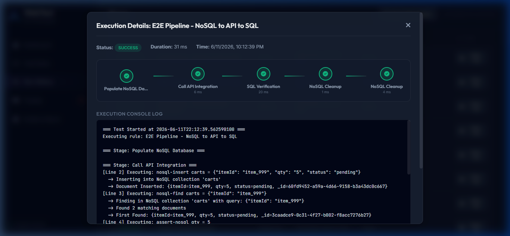
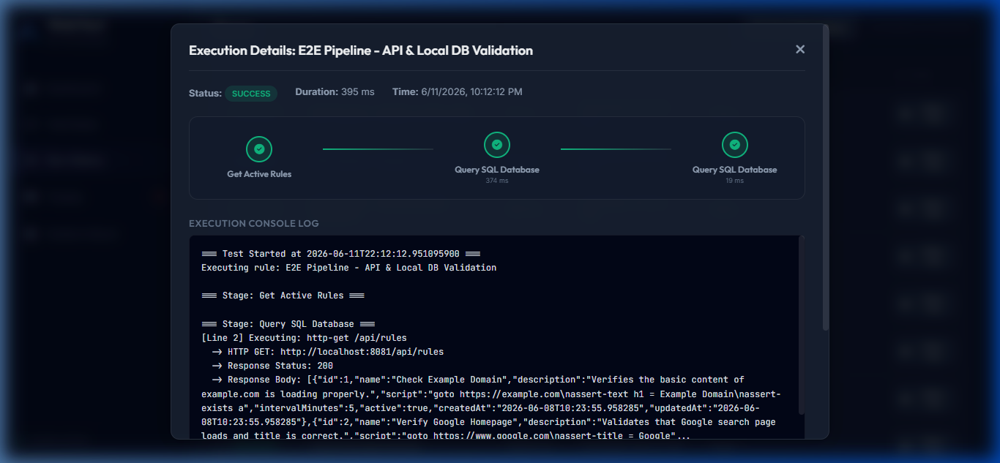

# Walkthrough - Advanced E2E Staging & API/DB Testing

We have successfully implemented E2E testing pipelines, SQL database connectivity, a simulated NoSQL document store, variable chaining across execution steps, and a visual pipeline stages component inside **WebTestNReport**.

---

## E2E Pipeline Capabilities Added

1. **Variables Context Store**: Support for resolving variable interpolation (e.g. `${orderId}`) dynamically at runtime. This allows extracting data from responses (`store-json`) or databases (`store-db`) and passing it downstream.
2. **Local Database Connection Pool Sharing**: Configured `db-connect` (without arguments) to automatically borrow a connection from the main Spring Boot Hikari connection pool, resolving H2 database file locking issues.
3. **Simulated NoSQL Document Store**: Created a lightweight JSON file-based database service inside the `./data/nosql` folder, supporting `nosql-insert`, `nosql-find`, `assert-nosql`, and `store-nosql` commands.
4. **Visual Stages Visualizer**: Added stepper stages rendering inside the run detail modal. If a stage is clicked, the console logs automatically scroll directly to the beginning of that stage's logs.
5. **Seeded E2E Demonstrations**: Seeded two detailed multi-stage rules in H2 database showing off E2E flows (API/SQL validation and NoSQL to API to SQL flow).

---

## Verification Results

We successfully executed E2E pipeline validations in the browser and verified all stages completed with status `SUCCESS`. Below are the screenshots and recording of the verification session.

### 1. NoSQL to API to SQL E2E Pipeline
Matches exact stages: **Populate NoSQL Database** $\rightarrow$ **Call API Integration** $\rightarrow$ **SQL Verification** $\rightarrow$ **NoSQL Cleanup**.

### 2. API & Local DB Validation E2E Pipeline
Matches exact stages: **Get Active Rules** $\rightarrow$ **Query SQL Database**.

### 3. Full Execution Video Recording
Here is the animation recording of the verification session running both E2E pipelines:

